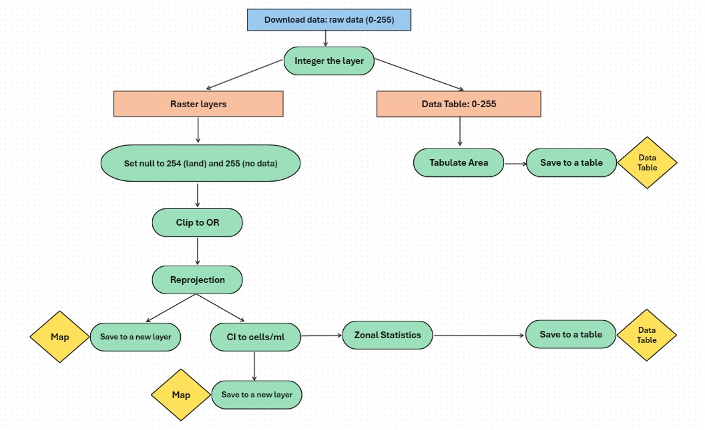

## Step 1. Download data from NASA's data site.

```{r}
# Download data from OceanData site - not working
day_start <- "2024054"

library(httr)
library(dplyr)

# Function to create a custom session for authentication
session <- function(username, password) {
  httr::authenticate(username, password)
}

# Define username and password
username <- "ygrund"
password <- "Cosmetic88&&"

# Create the session
my_session <- session(username, password)

dates <- readxl::read_excel("./data/calendar-dates.xlsx")
day_end <- dates %>% dplyr::filter(as.POSIXlt(Date) == as.POSIXlt(Sys.Date()-1)) %>% dplyr::pull(CyAN_File_NUM)
hab_days <- as.character(seq(day_start, day_end))
hab_days <- substr(hab_days, nchar(hab_days) - 2, nchar(hab_days))
hab_days_length <- length(hab_days)
print(paste0("Day State: ",dates[which(dates$CyAN_File_NUM == day_start),]$Date, " | ",day_start))
print(paste0("Day End: ",dates[which(dates$CyAN_File_NUM == day_end),]$Date, " | ",day_end))
print(paste0("Total Days | ",hab_days_length))

file_num <- dates %>% dplyr::filter(as.numeric(CyAN_File_NUM) >= as.numeric(day_start) & 
                                      as.numeric(CyAN_File_NUM) <= as.numeric(day_end))
tiles <- c("1_1","1_2","2_1","2_2")

outPath_ci <- "//deqhq1/WQ-Share/Harmful Algal Blooms Coordination Team/Satellite data/CyAN_Data_V5/Sentinel-3/CI_cyano/raw/"

for(fileNum in file_num$CyAN_File_NUM) {
  
  # test: fileNum = "2024054"
  year <- file_num %>% dplyr::filter(CyAN_File_NUM == fileNum) %>% dplyr::pull(Year)
  filename_list <- list()

  folder_path <- paste0(outPath_ci, year, "/temp/")
  if(!file.exists(folder_path)) {dir.create(folder_path, showWarnings = TRUE, recursive = FALSE)}else{}
  
  for(tile in tiles){
    
    # test: tile = "1_1"
    url <- paste0("https://oceandata.sci.gsfc.nasa.gov/getfile/L",fileNum,".L3m_DAY_CYAN_CI_cyano_CYAN_CONUS_300m_",tile,".tif")
    filename <- sub(".*/", "", url)
    
    tryCatch({
      # Submit the request using the configured session
      response <- httr::GET(
        url,
        httr::progress(),
        # httr::add_headers(`User-Agent` = "Mozilla/5.0"),
        httr::authenticate(username, password)
      )
      
      # Check for successful response
      if (httr::status_code(response) == 200) {
        # Save the file
        content <- httr::content(response, as = "raw")
        writeBin(content, paste0(outPath_ci,year,"/temp/",filename))
        print(paste0("File downloaded successfully: ",fileNum))
      } else {
        stop(paste0("Failed to download the file: ",filename))
      }
    }, error = function(e) {
      # Handle any errors here
      print(paste("Error:", e$message, " ", filename))
    })
    filename_list <- c(filename_list,filename)
  }
  
  # combine four tif flies into a single file
  raster1 <- raster::raster(paste0(outPath_ci,"/",year,"/temp/",filename_list[1]))
  raster2 <- raster::raster(paste0(outPath_ci,"/",year,"/temp/",filename_list[2]))
  raster3 <- raster::raster(paste0(outPath_ci,"/",year,"/temp/",filename_list[3]))
  raster4 <- raster::raster(paste0(outPath_ci,"/",year,"/temp/",filename_list[4]))
  raster_list <- list(raster1, raster2, raster3, raster4)
  merged_raster <- raster::merge(raster1, raster2, raster3, raster4)
  raster::writeRaster(merged_raster,
                      filename = paste0(outPath_ci,year,"/",stringr::str_sub(filename, start = 1, end = 8)),
                      format = "GTiff", overwrite = TRUE)
}

```

```{r}
# Download rasters from the OceanColor site
library(dplyr)

day_start <- "2024054"

baseurl <- "https://oceancolor.gsfc.nasa.gov/CYAN/OLCI/"
outPath_ci <- "//deqhq1/WQ-Share/Harmful Algal Blooms Coordination Team/Satellite data/CyAN_Data_V5/Sentinel-3/CI_cyano/raw/"

tiles <- paste0("_", paste(c("1_1","1_2","2_1","2_2"), collapse = "|"), "\\.tif$")

dates <- readxl::read_excel("./data/calendar-dates.xlsx")
year <- substr(day_start, 1, 4)
day_end <- dates %>% dplyr::filter(as.POSIXlt(Date) == as.POSIXlt(Sys.Date()-1)) %>% dplyr::pull(CyAN_File_NUM)
hab_days <- as.character(seq(day_start, day_end))
hab_days <- substr(hab_days, nchar(hab_days) - 2, nchar(hab_days))
hab_days_length <- length(hab_days)
print(paste0("Day State: ",dates[which(dates$CyAN_File_NUM == day_start),]$Date, " | ",day_start))
print(paste0("Day End: ",dates[which(dates$CyAN_File_NUM == day_end),]$Date, " | ",day_end))
print(paste0("Total Days | ",hab_days_length))

download_tgz_path <- paste0(outPath_ci, year, "/temp/tgz/")
download_tgz <- paste0('L', year, hab_days, '.L3m_DAY_CYAN_CI_cyano_CYAN_CONUS_300m.tgz')
url <- paste0(baseurl, year, '/', hab_days, '/', download_tgz)

for (i in 1:hab_days_length) {
  # test: i=1
  cat(url[i], "\n")
  
  utils::download.file(url[i], destfile = paste0(download_tgz_path, download_tgz[i]))
  utils::untar(paste0(download_tgz_path, download_tgz[i]), exdir = download_tgz_path)
  
  download_folder <- sub("\\.tgz$", "", file.path(download_tgz_path, download_tgz[i]))
  downloaded_files <- list.files(download_folder, full.names = TRUE)
  tile_files_from <- grep(tiles, downloaded_files, value = TRUE)
  tile_file_names <- sub(".*/", "", tile_files_from)
  for (file in tile_files_from) {
    tile_files_to <- gsub(paste0("/tgz/",substr(download_tgz[i],1, nchar(download_tgz[i]) - 4)), "", file)
    file.copy(from = file, to = tile_files_to)
  }
  
  # combine four tiles into a single file
  raster1 <- raster::raster(paste0(outPath_ci,"/",year,"/temp/",tile_file_names[1]))
  raster2 <- raster::raster(paste0(outPath_ci,"/",year,"/temp/",tile_file_names[2]))
  raster3 <- raster::raster(paste0(outPath_ci,"/",year,"/temp/",tile_file_names[3]))
  raster4 <- raster::raster(paste0(outPath_ci,"/",year,"/temp/",tile_file_names[4]))
  raster_list <- list(raster1, raster2, raster3, raster4)
  merged_raster <- raster::merge(raster1, raster2, raster3, raster4)
  raster::writeRaster(merged_raster,
                      filename = paste0(outPath_ci,year,"/",stringr::str_sub(tile_file_names[1], start = 2, end = 8)),
                      format = "GTiff", overwrite = TRUE)
}

```

## Step 2. Process data.



```{r}
Sys.setenv(RETICULATE_PYTHON = "C:\\Program Files\\ArcGIS\\Pro\\bin\\Python\\envs\\arcgispro-py3\\python.exe")
library(reticulate)
library(dplyr)
```

```{python}
import sys
import arcpy
from arcpy.sa import *
import pandas as pd
import os
import tempfile

arcpy.env.overwriteOutput = True
arcpy.CheckOutExtension("Spatial")

zones = r"\\deqhq1\WQ-Share\Harmful Algal Blooms Coordination Team\HAB_Shiny_app\data\gis\CyAN_Waterbodies.shp"
base_path = r"\\deqhq1\WQ-Share\Harmful Algal Blooms Coordination Team\Satellite data\CyAN_Data_V5\Sentinel-3\CI_cyano"

print("Create a temporary location to store the temporary output tables.")
temp_dir = os.path.join(base_path, "temp")
os.makedirs(temp_dir, exist_ok=True)

print("Initialize empty dataframes to store tabulate and zonal results.")
tabulate_result_df = pd.DataFrame(dtype='object')
zonal_result_df = pd.DataFrame(dtype='object')

try:
    day_start = r.day_start
    year = r.year
except:
    print("Provide start day.")
    
# day_start = "2016116"
# year = day_start[:4]

extent = arcpy.Extent(-2315637.32, 2919264.13, -1566307.49, 2284415.24)

raw_path = os.path.join(base_path, f"raw\\{year}")
ci_path = os.path.join(base_path, f"ci\\{year}")
cyan_path = os.path.join(base_path, f"cyan\\{year}")

temp_tabulate = os.path.join(temp_dir, f"tabulate_result_{year}.dbf")
temp_zonal = os.path.join(temp_dir, f"zonal_result_{year}.dbf")

raw_names = []
raw_files = os.listdir(raw_path)
raw_names.extend([file[:8] for file in raw_files if file.endswith("tif")])
start_index = raw_names.index('L' + day_start)
updated_raw_names = raw_names[start_index:]

for raw_name in updated_raw_names:
  arcpy.CheckOutExtension("Spatial")
  # test: raw_name = 'L2016118'
  print(raw_name)
  
  raw_tif_path = os.path.join(raw_path, f"{raw_name}.tif")
  output_ci_path = os.path.join(ci_path, f"{raw_name}.tif")
  output_cyan_path = os.path.join(cyan_path, f"{raw_name}.tif")
  
  raw_tif = arcpy.Raster(raw_tif_path)
  raw_tif_int = arcpy.sa.Int(raw_tif)
  
  outSetNull = arcpy.sa.SetNull(raw_tif_int, raw_tif_int, 'VALUE = 255 OR VALUE = 254') # 255=no_data 254=land
  
  try:
    if arcpy.management.GetRasterProperties(outSetNull, "MINIMUM") != 254:
      print("...Clip the raster for Oregon's extent")
      outSetNull_clip = arcpy.sa.ExtractByRectangle(outSetNull, extent)
      
      print("...Convert CyAN index to cells/ml")
      outCellsML = (arcpy.sa.Power(10, (3.0 / 250.0 * outSetNull_clip - 4.2))) * 100000000
      
      print("...Check if the output raster files already exists")
      if arcpy.Exists(output_ci_path):
        arcpy.Delete_management(output_ci_path)
        
      if arcpy.Exists(output_cyan_path):
        arcpy.Delete_management(output_cyan_path)
        
      print("...Save the output raster")
      outSetNull_clip.save(output_ci_path)
      
      print("...Compress outCellsML and save the output raster")
      arcpy.management.CopyRaster(in_raster=outCellsML,out_rasterdataset=output_cyan_path,format="TIFF")
      
      print("...Tabulate Area")
      tabulate_result = arcpy.sa.TabulateArea(
        in_zone_data=zones,
        zone_field="GNISIDNAME",
        in_class_data=raw_tif_int, # Use raw_tif_int (instead of outSetNull_clip) to include 254 & 255
        class_field="Value",
        out_table=temp_tabulate  # Use the temporary table path
        )
        
      print("...Add CyAN_File_NUM")
      if "CyAN_File_NUM" not in [f.name for f in arcpy.ListFields(temp_tabulate)]:
        arcpy.AddField_management(temp_tabulate, "CyAN_File_NUM", "TEXT")

      with arcpy.da.UpdateCursor(temp_tabulate, ["CyAN_File_NUM"]) as cursor:
        for row in cursor:
          row[0] = raw_name[1:]  # Remove the first character "L" from raw_name
          cursor.updateRow(row)
      
      print("...Convert tabulate result to dataframe and append to the final dataframe")
      tabulate_df = pd.DataFrame(arcpy.da.TableToNumPyArray(tabulate_result, '*'))
      if "OID" in tabulate_df.columns:
        tabulate_df = tabulate_df.drop(columns=['OID'])
      tabulate_result_df = pd.concat([tabulate_result_df, tabulate_df], ignore_index=True)
      
      print("...Zonal Statistics")
      arcpy.sa.ZonalStatisticsAsTable(
        in_zone_data=zones,
        zone_field="GNISIDNAME",
        in_value_raster=outCellsML,
        out_table=temp_zonal,
        ignore_nodata="DATA",
        statistics_type="ALL",
        process_as_multidimensional="CURRENT_SLICE",
        percentile_values=[100],
        percentile_interpolation_type="AUTO_DETECT",
        circular_calculation="ARITHMETIC",
        circular_wrap_value=360,
        out_join_layer=None
        )
        
      print("...Add CyAN_File_NUM")
      if "CyAN_File_NUM" not in [f.name for f in arcpy.ListFields(temp_zonal)]:
        arcpy.AddField_management(temp_zonal, "CyAN_File_NUM", "TEXT")
        
      with arcpy.da.UpdateCursor(temp_zonal, ["CyAN_File_NUM"]) as cursor:
        for row in cursor:
          row[0] = raw_name[1:]  # Remove the first character "L" from raw_name
          cursor.updateRow(row)
        
      print("...Convert zonal statistics result to dataframe and append to the final dataframe")
      zonal_df = pd.DataFrame(arcpy.da.TableToNumPyArray(temp_zonal, '*'))
      if "OID" in zonal_df.columns:
        zonal_df = zonal_df.drop(columns=['OID'])
      zonal_result_df = pd.concat([zonal_result_df, zonal_df], ignore_index=True)
    
      print("...Save intermediate results to CSV after each raw_name")
      tabulate_result_df.to_csv(os.path.join(temp_dir, f"tabulate_result_{raw_name}.csv"), index=False)
      zonal_result_df.to_csv(os.path.join(temp_dir, f"zonal_result_{raw_name}.csv"), index=False)
      
      print("...Clear dataframes for the next iteration")
      tabulate_result_df = pd.DataFrame(dtype='object')
      zonal_result_df = pd.DataFrame(dtype='object')
      
  except arcpy.ExecuteError:
    print("Raster contains only null values (254 and 255). Skipping further processing for this raster.")
    continue

```
